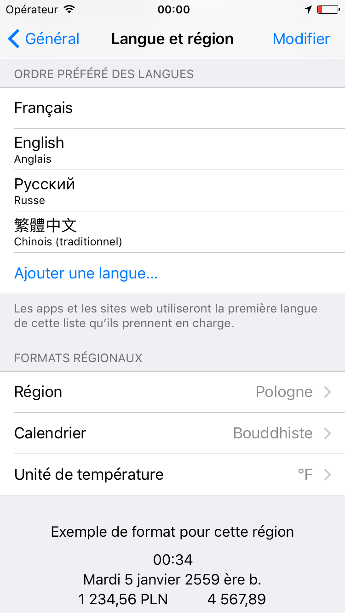
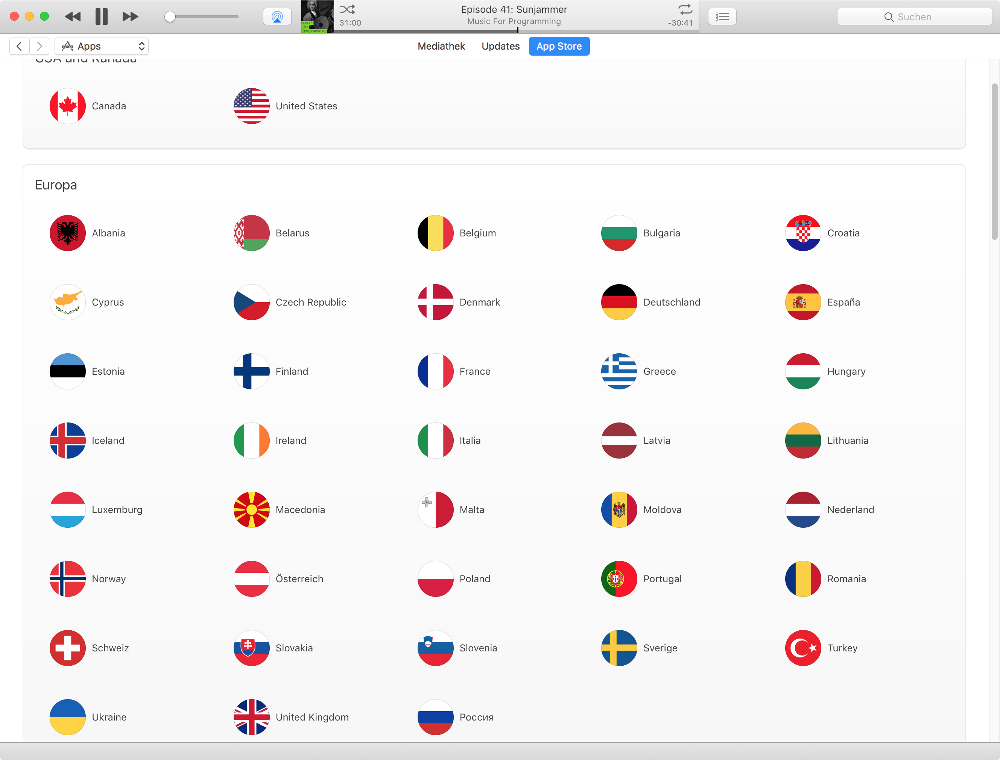

#In App Language Switching 
## _and Custom Localization_
^#### Jörg Bühmann, @orkoden, Evenly GmbH Berlin

---

##In app language switching allows the user to change the language in the app's settings menu.

---

#Evenly GmbH, Berlin
#www.evenly.io


Jörg Bühmann

@orkoden


---


^ French-German publicly financed TV station situated in Strassburg at the border between France and Germany. 

---


---

#[fit]Don't do it
#[fit]Your app probably doesn't need it
###bugs, subtle bugs, duplicate effort, bugs, maintenance, complexity, testing, time, money

^Apples does have pretty great localization built right into the OS!


---

#What's in a locale?
###_Lots of things_

---



^ French Buddhist who speaks Russian and Chinese in Poland

---

## Incomplete list of localization points

- language
- region, country
- calendar, time
- numbers
- currency
- measurement units
- punctuation

---

##Representation examples

- `en_GB, en_US, pl_PL, de_DE`
- `yue`
- `es_ES_PREEURO`
- `zh-Hant_HK_POSIX@collation=pinyin;currency=CNY`

---

## ~~NS~~Locale
```swift
static var availableIdentifiers: [String] {get}	 // 739
static var isoLanguageCodes: [String] {get} 	 // 594
static var isoRegionCodes: [String] {get}		 // 256
static var isoCurrencyCodes: [String] {get}		 // 299
static var commonISOCurrencyCodes: [String] {get}// 161
static var preferredLanguages: [String] {get}
```

---

## ~~NS~~Locale
```swift

func localizedString(forIdentifier identifier: String) -> String?
func localizedString(forLanguageCode languageCode: String) -> String?
func localizedString(forRegionCode regionCode: String) -> String?
func localizedString(forScriptCode scriptCode: String) -> String?
func localizedString(forVariantCode variantCode: String) -> String?
func localizedString(for calendarIdentifier: Calendar.Identifier) -> String?
func localizedString(forCurrencyCode currencyCode: String) -> String?
func localizedString(forCollationIdentifier collationIdentifier: String) -> String?
func localizedString(forCollatorIdentifier collatorIdentifier: String) -> String?
var identifier: String { get }
var languageCode: String? { get }
var regionCode: String? { get }
var scriptCode: String? { get }
var variantCode: String? { get }
var exemplarCharacterSet: CharacterSet? { get }
var calendar: Calendar { get }
var collationIdentifier: String? { get }
var usesMetricSystem: Bool { get }
var decimalSeparator: String? { get }
var groupingSeparator: String? { get }
var currencySymbol: String? { get }
var currencyCode: String? { get }
var collatorIdentifier: String? { get }
var quotationBeginDelimiter: String? { get }
var quotationEndDelimiter: String? { get }
var alternateQuotationBeginDelimiter: String? { get }
var alternateQuotationEndDelimiter: String? { get }

```

---

## ~~NS~~Calendar

```swift
case gregorian
case buddhist
case japanese
case chinese
case republicOfChina
case iso8601
case islamic
case islamicCivil
case islamicTabular
case islamicUmmAlQura
case persian
case indian
case martian
case coptic
case ethiopicAmeteMihret
case ethiopicAmeteAlem
case hebrew
```

---

## ~~NS~~NumberFormatter

```swift
var currencyDecimalSeparator: String! { get set }
var decimalSeparator: String! { get set }
// Determines whether the dollar sign character ($), 
// decimal separator character (.), 
// and thousand separator character (,) 
// are converted to appropriately localized characters 
// as specified by the user’s localization preference.
var localizesFormat: Bool { get set }
var currencySymbol: String!
var currencyCode: String!
var internationalCurrencySymbol: String! { get set }
```

---

#Demo

---

# Apple's APIs are great

Many take locale as a parameter

```swift
String.init(format: String, locale: Locale?, CVarArg...)
String.uppercased(locale)
Array.description(withLocale locale: Any?, indent level: Int)
NumberFormatter.locale	
```

`NSLocale, NSBundle, NSCalendar, NSNumberFormatter, NSDateFormatter, ...`


---

#[fit]Don't do it
#without very very good reasons

---

# Is the language changing or the content?

---



---


^ French-German publicly financed TV station situated in Strassburg at the border between France and Germany. 

---


^ So for a long time, there was only French and German

---


^ But then more languages were added

---

##Language change can affect 

- available content
- features
- UI language
- UI layout


---

# Let's build our own NSLocalizedString

---

#What are Localized.strings files?
- Big-endian UTF-16 Unicode text, with CR, LF line terminators
- Just a plist
- key value dictionary
- /usr/libexec/PlistBuddy

---

#NSBundle.h

```objectivec
#define NSLocalizedString(key, comment) \
	    [NSBundle.mainBundle localizedStringForKey:(key) value:@"" table:nil]
#define NSLocalizedStringFromTable(key, tbl, comment) \
	    [NSBundle.mainBundle localizedStringForKey:(key) value:@"" table:(tbl)]
#define NSLocalizedStringFromTableInBundle(key, tbl, bundle, comment) \
	    [bundle localizedStringForKey:(key) value:@"" table:(tbl)]
#define NSLocalizedStringWithDefaultValue(key, tbl, bundle, val, comment) \
	    [bundle localizedStringForKey:(key) value:(val) table:(tbl)]
```

---

#Global Swift Foundation Function

```swift
func NSLocalizedString(_ key: String, 
						 tableName: String? = default, 
						 bundle: Bundle = default, 
						 value: String = default, 
						 comment: String) -> String
```

---
#~~NS~~Bundle

```swift
func localizedString(forKey: String, 
					 value: String?, 
					 table: String?) -> String
```
`table` is the name of your `.strings` files. `"fr"` for `fr.strings`

^ Cool! So we just swizzle bundle loading!

---

#Demo

---

#Fighting against the system

- button styles like `.done, .cancel`
- `Error.localizedString` 
- `MFMailComposeViewController`
- `EKEventEditViewController`
- Spotlight
- mixed language UI possible

^ Build your own Swift errors conforming to `Error` and `LocalizedError`

--- 

#Actually changing the language
##_all that state!_
^ use my language injection framework!

--- 

#Actually changing the language

- `exit(0)`
- listen to notifications
- KVO
- reactive
- throw away everything and rebuild

--- 

#Throw away everything
##_just like Springboard!_


---

#Rebuild

- exchange root view controller
- other objects (e.g. cached date formatters)
- third party SDKs
- dependency injection is your friend

---

#[fit]Changing the root view controller without leaking

```swift
public extension UIWindow {
    public func at_setRootViewController(_ newRootViewController: UIViewController, transition: CATransition? = nil) {
        let previousViewController = rootViewController
        rootViewController = newRootViewController
        newRootViewController.setNeedsStatusBarAppearanceUpdate()
        
        if let transitionViewClass = NSClassFromString("UITransitionView") {
            for subview in subviews where subview.isKind(of: transitionViewClass) {
                subview.removeFromSuperview()
            }
        }
        if let previousViewController = previousViewController {
            previousViewController.dismiss(animated: false) {
                previousViewController.view.removeFromSuperview()
            }
        }
    }
}


```

http://stackoverflow.com/a/27153956/849645

---

#[fit]Apple's API's are great
#_use them_ 
##_customize only when you need_

---

#Questions?


Jörg Bühmann

@orkoden

www.evenly.io

www.github.com/orkoden

---

# Show .strings file diffs in git

`.gitconfig`

	[diff "localizablestrings"]
		textconv = "iconv -f utf-16 -t utf-8"
		binary = false


